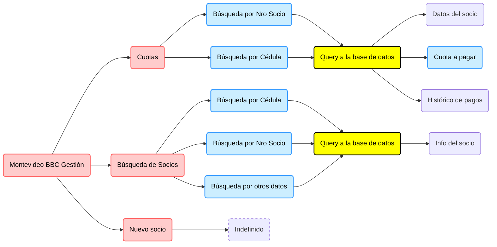
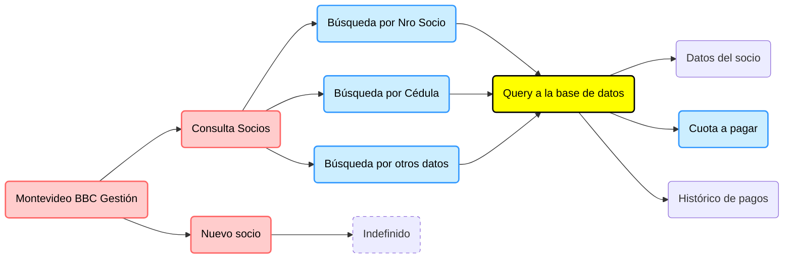
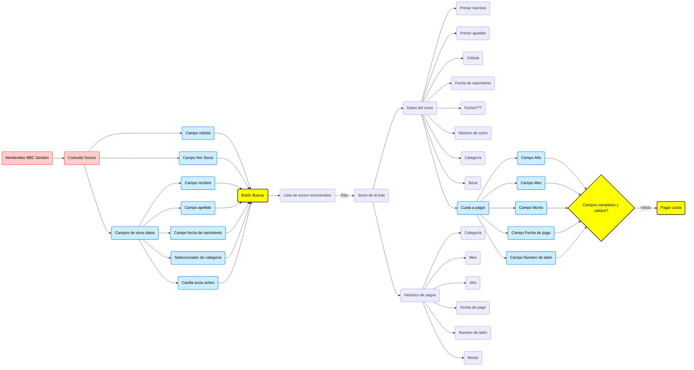

# Diagrama original de cómo estaba hecho

```mermaid
flowchart LR
  
  %% Class definition
  
    classDef Primary color:#000000,fill:#ffcccc,stroke:#ff6666,stroke-width:2px;
    classDef Secondary color:#000000,fill:#cceeff,stroke:#3399ff,stroke-width:2px;
    classDef Terciary color:#000000,fill:#ffff00,stroke:#000000,stroke-width:2px;
    classDef Dashed stroke-dasharray: 5 5;

  %% Steps definitions
  
  idHome(Montevideo BBC Gestión):::Primary
  idCuotas(Cuotas):::Primary
    idBusquedaPorCedula1(Búsqueda por Cédula):::Secondary
    idBusquedaPorNroSocio1(Búsqueda por Nro Socio):::Secondary
      idDatosDelSocio(Datos del socio):::Output
      idCuotaAPagar(Cuota a pagar):::Secondary
      idHistoricoDePagos(Histórico de pagos):::Output
  idBusquedaSocios(Búsqueda de Socios):::Primary
    idBusquedaPorCedula2(Búsqueda por Cédula):::Secondary
    idBusquedaPorNroSocio2(Búsqueda por Nro Socio):::Secondary
    idOtrosDatos(Búsqueda por otros datos):::Secondary
      idSocio(Info del socio):::Output
  idNuevoSocio(Nuevo socio):::Primary
    idEnDesarrollo(Indefinido):::Dashed

  idTraeDatosSocio(Query a la base de datos):::Terciary
  idTraeDatosSocio2(Query a la base de datos):::Terciary

  %% Logic connections

  idHome --> idCuotas
    idCuotas --> idBusquedaPorCedula1
    idCuotas --> idBusquedaPorNroSocio1
      idBusquedaPorNroSocio1 --> idTraeDatosSocio
      idBusquedaPorCedula1 --> idTraeDatosSocio
      idTraeDatosSocio --> idDatosDelSocio
      idTraeDatosSocio --> idCuotaAPagar
      idTraeDatosSocio --> idHistoricoDePagos
  idHome --> idBusquedaSocios
    idBusquedaSocios --> idBusquedaPorCedula2
    idBusquedaSocios --> idBusquedaPorNroSocio2
    idBusquedaSocios --> idOtrosDatos
      idBusquedaPorCedula2 --> idTraeDatosSocio2
      idBusquedaPorNroSocio2 --> idTraeDatosSocio2
      idOtrosDatos --> idTraeDatosSocio2
      idTraeDatosSocio2 --> idSocio
  idHome --> idNuevoSocio
    idNuevoSocio --> idEnDesarrollo

```

# Versión mejorada y optimizada

```mermaid
flowchart LR
  
  %% Class definition
  
    classDef Primary color:#000000,fill:#ffcccc,stroke:#ff6666,stroke-width:2px;
    classDef Secondary color:#000000,fill:#cceeff,stroke:#3399ff,stroke-width:2px;
    classDef Terciary color:#000000,fill:#ffff00,stroke:#000000,stroke-width:2px;
    classDef Dashed stroke-dasharray: 5 5;

  %% Steps definitions
  
  idHome(Montevideo BBC Gestión):::Primary
  idConsultaSocio(Consulta Socios):::Primary
    idBusquedaPorCedula1(Búsqueda por Cédula):::Secondary
    idBusquedaPorNroSocio1(Búsqueda por Nro Socio):::Secondary
      idDatosDelSocio(Datos del socio):::Output
      idCuotaAPagar(Cuota a pagar):::Secondary
      idHistoricoDePagos(Histórico de pagos):::Output
    idBusquedaOtrosDatos(Búsqueda por otros datos):::Secondary
  idNuevoSocio(Nuevo socio):::Primary
    idEnDesarrollo(Indefinido):::Dashed

  idTraeDatosSocio(Query a la base de datos):::Terciary

  %% Logic connections

  idHome --> idConsultaSocio
    idConsultaSocio --> idBusquedaPorCedula1
    idConsultaSocio --> idBusquedaPorNroSocio1
    idConsultaSocio --> idBusquedaOtrosDatos
      idBusquedaPorNroSocio1 --> idTraeDatosSocio
      idBusquedaPorCedula1 --> idTraeDatosSocio
      idBusquedaOtrosDatos --> idTraeDatosSocio
      idTraeDatosSocio --> idDatosDelSocio
      idTraeDatosSocio --> idCuotaAPagar
      idTraeDatosSocio --> idHistoricoDePagos
  idHome --> idNuevoSocio
    idNuevoSocio --> idEnDesarrollo

```

```mermaid
flowchart LR
  
  %% Class definition
  
    classDef Primary color:#000000,fill:#ffcccc,stroke:#ff6666,stroke-width:2px;
    classDef Secondary color:#000000,fill:#cceeff,stroke:#3399ff,stroke-width:2px;
    classDef Terciary color:#000000,fill:#ffff00,stroke:#000000,stroke-width:2px;
    classDef Dashed stroke-dasharray: 5 5;
    classDef Input color:#000000,fill:#cceeff,stroke:#3399ff,stroke-width:2px;

  %% Steps definitions
  
  idHome(Montevideo BBC Gestión):::Primary
  idConsultaSocio(Consulta Socios):::Primary
    idCampoCedula(Campo cédula):::Input
    idCampoNroSocio(Campo Nro Socio):::Input
    idFormOtrosDatos(Campos de otros datos):::Input
      idCampoNombre(Campo nombre):::Input
      idCampoApellido(Campo apellido):::Input
      idCampoBirthDate(Campo fecha de nacimiento):::Input
      idSelectCategory(Seleccionador de categoría):::Input
      idCheckSocioActivo(Casilla socio activo):::Input

      idBotonBuscar(Botón Buscar):::Terciary

      idListaSocios(Lista de socios encontrados)

      idSocio(Socio de la lista)

      idFormDatosDelSocio(Datos del socio):::Output
        idNombre(Primer Nombre):::Output
        idApellido(Primer apellido):::Output
        idCedula(Cédula):::Output
        idBirthDate(Fecha de nacimiento):::Output
        idDate(Fecha???)
        idNumeroDeSocio(Número de socio):::Output
        idCategory(Categoría):::Output
        idBeca(Beca):::Output


      idCuotaAPagar(Cuota a pagar):::Secondary
        idCampoYear(Campo Año):::Input
        idCampoMes(Campo Mes):::Input
        idMonto(Campo Monto):::Input
        idPaymentDate(Campo Fecha de pago):::Input
        idNumeroDeTalon(Campo Número de talón):::Input
     
      idValidarPagarCuota{Campos completos y validos?}:::Terciary
      idBotonPagarCuota(Pagar cuota):::Terciary

      idHistoricoDePagos(Histórico de pagos):::Output
        idHistoricCategory(Categoría):::Output
        idHistoricMonth(Mes):::Output
        idHistoricYear(Año):::Output
        idHistoricPaymentDate(Fecha de pago):::Output
        idHistoricTalonNumber(Número de talón):::Output
        idHistoricMount(Monto):::Output


  %% Logic connections
  
  idHome --> idConsultaSocio
    
    idConsultaSocio --> idCampoCedula --> idBotonBuscar
    idConsultaSocio --> idCampoNroSocio --> idBotonBuscar
    idConsultaSocio --> idFormOtrosDatos 
      idFormOtrosDatos --> idCampoNombre --> idBotonBuscar
      idFormOtrosDatos --> idCampoApellido --> idBotonBuscar
      idFormOtrosDatos --> idCampoBirthDate --> idBotonBuscar
      idFormOtrosDatos --> idSelectCategory --> idBotonBuscar
      idFormOtrosDatos --> idCheckSocioActivo --> idBotonBuscar


      idBotonBuscar --> idListaSocios -- Elijo --> idSocio

      idSocio --> idFormDatosDelSocio
        idFormDatosDelSocio --> idNombre
        idFormDatosDelSocio --> idApellido
        idFormDatosDelSocio --> idCedula
        idFormDatosDelSocio --> idBirthDate
        idFormDatosDelSocio --> idDate
        idFormDatosDelSocio --> idNumeroDeSocio
        idFormDatosDelSocio --> idCategory
        idFormDatosDelSocio --> idBeca
        idFormDatosDelSocio --> idCuotaAPagar
          idCuotaAPagar --> idCampoYear --> idValidarPagarCuota
          idCuotaAPagar --> idCampoMes --> idValidarPagarCuota
          idCuotaAPagar --> idMonto --> idValidarPagarCuota
          idCuotaAPagar --> idPaymentDate --> idValidarPagarCuota
          idCuotaAPagar --> idNumeroDeTalon --> idValidarPagarCuota
          idValidarPagarCuota -- Valido --> idBotonPagarCuota

      idSocio --> idHistoricoDePagos
        idHistoricoDePagos --> idHistoricCategory
        idHistoricoDePagos --> idHistoricMonth
        idHistoricoDePagos --> idHistoricYear
        idHistoricoDePagos --> idHistoricPaymentDate
        idHistoricoDePagos --> idHistoricTalonNumber
        idHistoricoDePagos --> idHistoricMount
```
